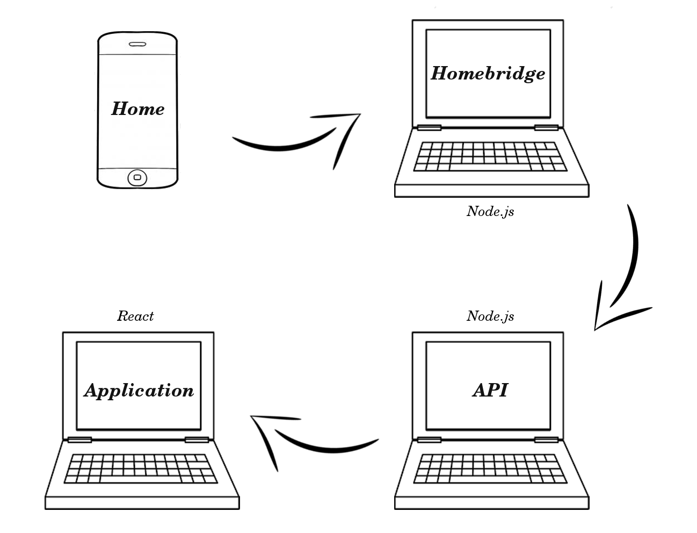

# Projet Homebridge

Homebridge est un serveur Node.js permettant d'émuler des objets compatible avec l'API HomeKit d'Apple et ainsi d'être capable de les manipuler grâce à l'application Home disponible depuis iOS 10.

Ce projet a pour but de créer un robot "majordome" contrôlable depuis son iPhone en passant par un serveur Homebridge.

Actuellement le projet permet de régler 2 lampes et 2 verrous virtuels avec l'application Home et permet de visualiser les modifications sur une application React.

## Pré-requis techniques

Les pré-requis techniques sont les suivants :

* Node et NPM
* Homebridge

### Node.js

Téléchargez et installez la version de Node.js correspondant à votre système d'exploitation, en suivant les indications disponibles sur le [site officiel](https://nodejs.org/en/download/).

Vérifiez l'installation en lançant les commandes suivantes dans un terminal :

```
$ node -v

$ npm -v
```

### Homebridge

Téléchargez et installez Homebridge en suivant les indications disponibles sur le [github d'Homebridge](https://github.com/nfarina/homebridge).

Ensuite déplacez le fichier config.json situé à la racine du projet dans le dossier de configuration d'Homebridge,

par défaut : ```~/.homebridge/```

## Installation

Lancez le script ```$ ./install.sh``` qui va s'occuper de lancer les ```npm install``` nécessaires.

Dans le dossier react-app/src/components, modifiez la variable api dans lightbulb.js et lock.js pour qu'elle corresponde à l'adresse de l'api.

Modifiez aussi la variable host dans le fichier react-app/webpack.config.js pour qu'elle corresponde à l'adresse de votre ordinateur.

## Lancement

Ouvrez trois consoles et lancez les scripts :
* l'API : ```$ ./launchAPI.sh```
* Homebridge : ```$ ./launchHomebridge.sh```
* l'application : ```$ ./launchReactApp.sh```

## Architecture

Nos lampes/verrous sont ajoutés à Homebridge par des plugins qui se trouvent dans le dossier ```./hb-plugins```. Ces plugins contiennent notamment les fonctions permettant d'utiliser les composants et de récuperer leur état.

Homebridge communique les changements de nos objets à l'API par des requêtes HTTP. L'API est un serveur Node.js utilisant le framework Express. Les états des objets sont stockés dans des fichiers JSON sur le serveur.

L'application permettant la visualisation de nos objets utilise React et implémente un composant par plugin Homebridge. Les composants React reçoivent les changements sur les objets en s'abonnant à l'API via les Server Send Event.

